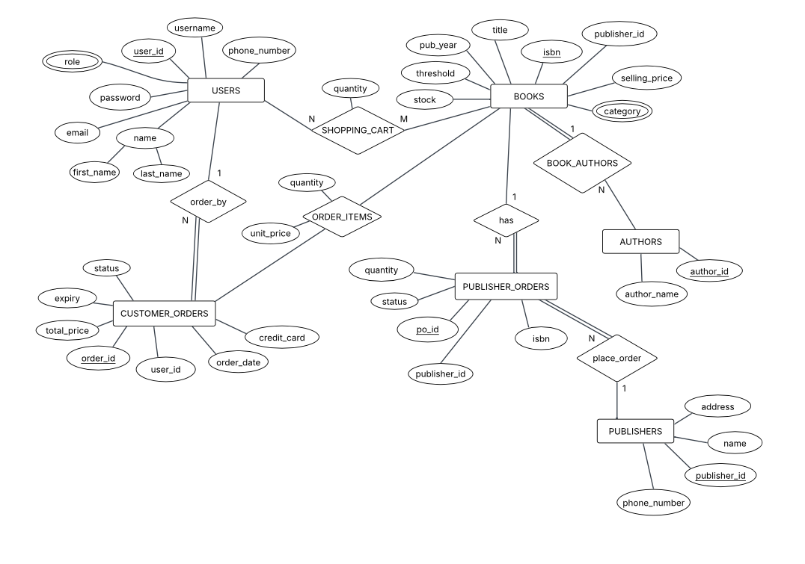

# 📋 Online Bookstore - Project Discussion Report

---

## 1. Implemented Features

### 1.1 Customer Features

| Feature                | Description                                                                |
| ---------------------- | -------------------------------------------------------------------------- |
| **User Registration**  | Create account with username, password, email, phone, and shipping address |
| **User Login**         | Authenticate with username/password, role-based redirection                |
| **Book Search**        | Search by ISBN, title, author, publisher, or category                      |
| **Shopping Cart**      | Add/remove/update items, view cart totals                                  |
| **Checkout**           | Enter credit card details, validate expiry, place order                    |
| **Order History**      | View past orders with items and totals                                     |
| **Profile Management** | Update personal info and password                                          |

### 1.2 Admin Features

| Feature              | Description                                                       |
| -------------------- | ----------------------------------------------------------------- |
| **Dashboard**        | Live stats: total books, customers, pending orders, monthly sales |
| **Low Stock Alerts** | Display books below threshold                                     |
| **Add Book**         | Create new book with authors, publisher, price, category          |
| **Modify Book**      | Search and edit existing book details                             |
| **Add Publisher**    | Register new publisher with contact info                          |
| **Publisher Orders** | View pending/confirmed replenishment orders                       |
| **Confirm Orders**   | Approve publisher orders (auto-updates stock)                     |
| **Sales Reports**    | Monthly sales, daily sales, top customers, top books              |

### 1.3 System Features

| Feature                       | Description                                                            |
| ----------------------------- | ---------------------------------------------------------------------- |
| **Auto-Reorder Trigger**      | Automatically creates publisher order when stock drops below threshold |
| **Stock Deduction**           | Automatically reduces stock when customer purchases                    |
| **Stock Addition**            | Automatically adds stock when publisher order confirmed                |
| **Negative Stock Prevention** | Database trigger prevents stock from going negative                    |

---

## 2. Entity-Relationship Diagram (ERD)

---

## 3. Relational Schema

---

## 4. User Interface Screens

### 4.1 Public Screens

#### Login Page (`/login`)

| Element        | Logic                                                                                           |
| -------------- | ----------------------------------------------------------------------------------------------- |
| Username Field | Text input, required                                                                            |
| Password Field | Password input, required                                                                        |
| Login Button   | Validates credentials via `User.login()`, creates session, redirects to dashboard based on role |
| Register Link  | Navigates to registration page                                                                  |

#### Register Page (`/register`)

| Element     | Logic                                                                                     |
| ----------- | ----------------------------------------------------------------------------------------- |
| Form Fields | Username, password, name, email, phone, address                                           |
| Validation  | Username format, password strength (8+ chars, uppercase, lowercase, number), email format |
| Submit      | Creates user via `User.register_user()`, redirects to login on success                    |

---

### 4.2 Customer Screens

#### Customer Dashboard (`/customer/dashboard`)

| Element    | Logic                                                        |
| ---------- | ------------------------------------------------------------ |
| Book Grid  | Displays all books from database with title, price, category |
| Navigation | Links to Search, Cart, Orders, Profile                       |

#### Search Books (`/customer/search`)

| Element           | Logic                                                       |
| ----------------- | ----------------------------------------------------------- |
| Search Form       | Fields for ISBN, title, author, publisher                   |
| Category Dropdown | Filter by Science, Art, Religion, History, Geography        |
| Search Button     | Calls `Book.search_books()` with parameters                 |
| Results Grid      | Shows matching books with Add to Cart button                |
| Add to Cart       | AJAX POST to `/customer/cart/add`, updates cart count badge |

#### Shopping Cart (`/customer/cart`)

| Element          | Logic                                             |
| ---------------- | ------------------------------------------------- |
| Cart Items Table | Lists items with title, price, quantity, subtotal |
| Quantity Input   | Updates quantity via `/customer/cart/update`      |
| Remove Button    | Removes item via `/customer/cart/remove`          |
| Clear Cart       | Empties cart via `/customer/cart/clear`           |
| Total Display    | Sum of (price × quantity) for all items           |
| Checkout Button  | Navigates to checkout page                        |

#### Checkout (`/customer/checkout`)

| Element            | Logic                                                                               |
| ------------------ | ----------------------------------------------------------------------------------- |
| Order Summary      | Lists cart items with prices                                                        |
| Shipping Address   | Pre-filled from user profile                                                        |
| Credit Card Field  | 16-digit validation                                                                 |
| Expiry Dropdowns   | Month (1-12) and Year selection                                                     |
| CVV Field          | 3-digit validation                                                                  |
| Place Order Button | Validates card, calls `Order.create_order()`, triggers stock deduction, clears cart |

#### Order History (`/customer/orders`)

| Element         | Logic                                     |
| --------------- | ----------------------------------------- |
| Orders List     | All user orders sorted by date descending |
| Order Card      | Shows order ID, date, total, status       |
| Items Accordion | Expandable list of books in each order    |

#### Profile (`/customer/profile`)

| Element           | Logic                                                        |
| ----------------- | ------------------------------------------------------------ |
| User Info Display | Shows current name, email, phone, address                    |
| Edit Form         | Update fields (first name, last name, email, phone, address) |
| Password Change   | Optional: enter new password                                 |
| Save Button       | Calls `User.update_profile()`                                |
| Order Stats       | Total number of orders placed                                |

---

### 4.3 Admin Screens

#### Admin Dashboard (`/admin/dashboard`)

| Element         | Logic                                                 |
| --------------- | ----------------------------------------------------- |
| Stats Cards     | Total books, customers, pending orders, monthly sales |
| Low Stock Table | Books where `stock < threshold`                       |
| Quick Links     | Navigate to Add Book, Modify Book, Orders, Reports    |

#### Add Book (`/admin/add-book`)

| Element                | Logic                                                     |
| ---------------------- | --------------------------------------------------------- |
| ISBN Field             | Validated for proper format                               |
| Title Field            | Required text                                             |
| Publisher Dropdown     | Populated from `Publisher.get_all_publishers()`           |
| Year, Price, Threshold | Numeric inputs                                            |
| Category Dropdown      | Fixed options: Science, Art, Religion, History, Geography |
| Authors Field          | Comma-separated author names                              |
| Submit                 | Calls `Book.add_book()`, creates authors if needed        |

#### Modify Book (`/admin/modify-book`)

| Element        | Logic                                        |
| -------------- | -------------------------------------------- |
| Search Form    | Enter ISBN or title to find book             |
| Search Results | List of matching books with Edit button      |
| Edit Mode      | Pre-populated form with current book details |
| Update Form    | All book fields editable (except ISBN)       |
| Save Button    | Calls `Book.update_book()`                   |

#### Publisher Orders (`/admin/orders`)

| Element                | Logic                                                        |
| ---------------------- | ------------------------------------------------------------ |
| Customer Orders Table  | Recent customer orders with username, date, total            |
| Pending Orders Table   | Unconfirmed publisher orders                                 |
| Confirm Button         | Updates order status to 'Confirmed', triggers stock addition |
| Confirmed Orders Table | Recently confirmed orders                                    |
| Stats                  | Total, pending, confirmed counts                             |

#### Reports (`/admin/reports`)

| Element              | Logic                                                     |
| -------------------- | --------------------------------------------------------- |
| Monthly Sales Button | Shows total sales for last 30 days                        |
| Daily Sales Form     | Date picker, shows sales for selected date                |
| Top Customers Button | Shows top 5 customers by spending (last 3 months)         |
| Top Books Button     | Shows top 10 selling books by quantity (last 3 months)    |
| Replenishment Form   | Enter ISBN, shows count of publisher orders for that book |

---

## 5. Database Triggers Summary

| Trigger                        | Event                            | Action                                                 |
| ------------------------------ | -------------------------------- | ------------------------------------------------------ |
| `Prevent_Negative_Stock`       | BEFORE UPDATE on Books           | Throws error if stock < 0                              |
| `Auto_Order_Trigger`           | AFTER UPDATE on Books            | Creates Publisher_Order if stock drops below threshold |
| `Update_Stock_On_Confirmation` | AFTER UPDATE on Publisher_Orders | Adds quantity to stock when status = 'Confirmed'       |
| `Deduct_Stock_On_Purchase`     | AFTER INSERT on Order_Items      | Subtracts quantity from stock                          |

---

## 6. Test Credentials

| Role         | Username     | Password    |
| ------------ | ------------ | ----------- |
| Admin        | admin        | password123 |
| Customer     | john_doe     | password123 |
| VIP Customer | vip_customer | password123 |
